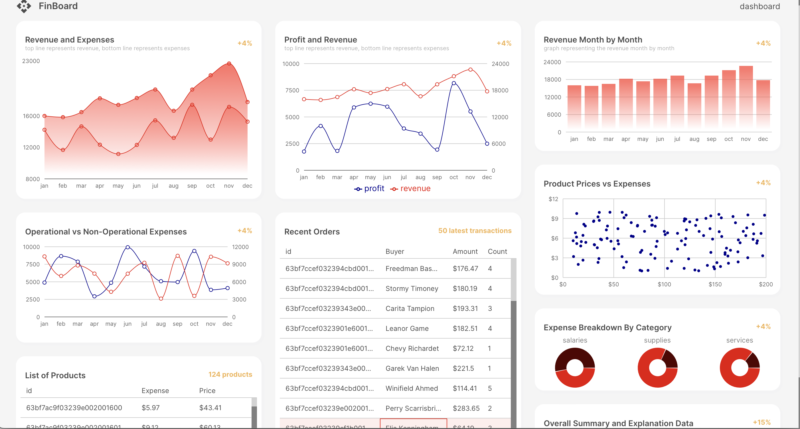

# MERN Stack Finance Dashboard



# MERN Finance Dashboard App 🚀

**Elevate Your Financial Journey with Data-Driven Insights**

Introducing the **MERN Finance Dashboard App**, your go-to tool for making informed financial decisions.

## Key Features:
- **Interactive Dashboard:** Visualize your financial data with stunning charts and graphs.
- **AI-Powered Predictions:** Harness the power of machine learning for future insights.
- **Robust Security:** Protect your sensitive information with secure authentication.
- **Seamless Experience:** Enjoy a responsive design optimized for any device.

## Built with:
- **Frontend:** Vite, React, Redux Toolkit, Material UI, Recharts
- **Backend:** Node.js, Express.js, MongoDB
- **Machine Learning:** Data-driven insights for smarter decisions

## Getting Started:

1. **Clone the Repository:**  
   Run the following command to clone the repository:  
   ```bash
   git clone https://github.com/Revanth-shivakumar/finance-dashboard.git
